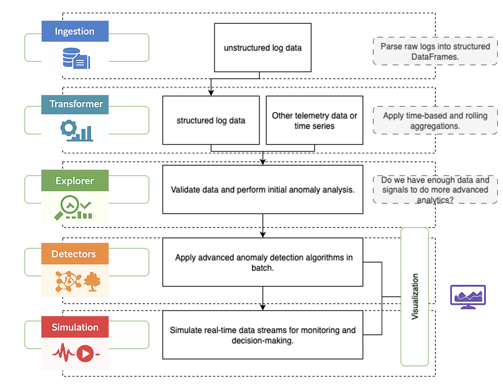

 
# Summary
 
Modern enterprise systems generate large volumes of operational logs that contain information about system behavior, performance, and failure conditions. These logs are frequently used for troubleshooting, monitoring, and anomaly detection. However, raw logs are typically unstructured and heterogeneous, making it difficult to determine whether they contain meaningful signals for analytical methods. Applying anomaly detection algorithms without first validating the quality and informational content of the data can lead to misleading results or unnecessary computational costs.
 
Sentinel is a Python library designed to address this challenge by introducing **early signal validation for enterprise logs prior to anomaly detection**. The library provides a modular pipeline that transforms unstructured logs into structured data, evaluates the presence of meaningful statistical signals, and applies anomaly detection algorithms only when the data meets predefined quality criteria. This fail-fast validation approach helps practitioners determine whether log datasets are suitable for anomaly analysis before investing effort in complex modeling pipelines.
 
The library supports common enterprise log formats and provides tools for ingestion, transformation, signal validation, anomaly detection, visualization, and streaming simulation. Sentinel is implemented in Python and builds upon widely used scientific computing libraries including pandas [@mckinney2010pandas] and scikit-learn [@pedregosa2011sklearn], with optional deep learning detectors implemented using PyTorch [@paszke2019pytorch].
 
# Statement of Need
 
Enterprise infrastructures such as application servers, message brokers, security modules, and networking systems continuously produce operational logs. These logs often contain indicators of system failures, abnormal activity, or performance degradation. Detecting anomalies in log data is therefore an important task in operational monitoring, cybersecurity, and reliability engineering.
 
Despite the extensive literature on anomaly detection methods [@chandola2009anomaly], a practical challenge often arises in real-world environments: **not all log data contains analyzable signals**. Logs may contain excessive missing values, constant fields, inconsistent timestamps, or insufficient variability to support meaningful detection algorithms. In such situations, applying machine learning models can produce unstable or misleading outputs.
 
Most anomaly detection libraries focus on the modeling stage and assume that the input data already contains useful patterns. Libraries such as PyOD [@zhao2019pyod], ADTK [@adtk2019], pySAD [@yilmaz2021pysad], TODS [@lai2021tods], and Anomalib [@akcay2022anomalib] provide extensive implementations of detection algorithms, but they generally rely on pre-processed, signal-rich datasets.
 
Sentinel addresses the earlier stage of the workflow: **determining whether a log dataset is suitable for anomaly detection in the first place**. The library evaluates signal quality metrics before applying detectors, enabling practitioners to avoid unnecessary modeling steps when the underlying data lacks informative structure. This approach is particularly valuable for enterprise logs, where large datasets may still contain limited analytical value.
 
# State of the Field
 
The ecosystem of anomaly detection software has expanded significantly in recent years. PyOD [@zhao2019pyod] provides a unified interface for a wide range of outlier detection algorithms. ADTK [@adtk2019] focuses on time-series anomaly detection using rule-based and statistical techniques. pySAD [@yilmaz2021pysad] addresses streaming anomaly detection scenarios, while TODS [@lai2021tods] introduces automated machine learning pipelines for time-series outlier detection. Anomalib [@akcay2022anomalib] provides deep learning architectures primarily targeting computer vision applications.
 
In the context of log analysis, research has also explored specialized anomaly detection techniques such as DeepLog, which applies recurrent neural networks to learn sequential patterns in system logs [@du2017deeplog]. Public datasets such as LogHub provide standardized benchmarks for evaluating log anomaly detection approaches [@he2020loghub].
 
These tools and datasets have significantly advanced anomaly detection research. However, they typically assume that the dataset has already undergone preprocessing and validation. In many operational environments, the primary difficulty lies in determining whether the available logs contain sufficient information to justify anomaly detection.
 
Sentinel complements existing tools by introducing a **signal validation stage before detection**. Rather than replacing existing anomaly detection libraries, Sentinel can be used alongside them to assess data suitability and prepare structured log datasets for downstream analysis.
 
# Software Design
 
Sentinel implements a modular architecture designed to support the complete lifecycle of enterprise log analysis. The system is organized into six core modules that can be used independently or combined into a unified pipeline.
 

 
| Module | Purpose | Techniques and Components |
|------|------|------|
| **Ingestion** | Convert raw log files into structured tabular data | Parsers for WAS, HSM, HDC, IBMMQ and ZTNA logs; extensible parser interface |
| **Transformer** | Prepare logs for analysis | Time aggregation, rolling statistics, feature generation |
| **Explorer** | Validate signal presence before anomaly detection | IQR anomaly checks, variance thresholds, label validation, correlation analysis |
| **Detectors** | Apply anomaly detection algorithms | Isolation Forest [@liu2008isolation], Robust Random Cut Forest [@guha2016rrcf], LSTM Autoencoder, Liquid Neural Networks [@hasani2021liquid] |
| **Visualization** | Interpret anomaly detection outputs | Time-series anomaly visualization and SHAP-based explainability [@lundberg2017shap] |
| **Simulation** | Test streaming anomaly detection workflows | Real-time chunk processing and adaptive thresholds |
 
The **Ingestion module** converts unstructured log files into structured tabular representations using pandas. Sentinel includes built-in parsers for enterprise systems such as WebSphere Application Server (WAS), Hardware Security Modules (HSM), High-Density Computing (HDC), IBM Message Queue (IBMMQ), and ZTNA logs. A base parser interface allows users to implement custom parsers for additional log formats.
 
The **Transformer module** prepares structured logs for analysis by aggregating events into time windows and computing rolling statistics. These transformations allow event-based logs to be converted into feature matrices suitable for statistical or machine learning methods.
 
The **Explorer module** is the central innovation of the library. It evaluates signal quality using statistical metrics including interquartile range (IQR) anomaly checks, variance thresholds, label presence validation, and correlation analysis. The module also evaluates simple predictive models on individual features to estimate signal relevance. Based on these metrics, the module provides a fail-fast decision indicating whether further analysis is justified.
 
The **Detectors module** provides a unified interface for multiple anomaly detection algorithms. Implementations include Isolation Forest [@liu2008isolation], Robust Random Cut Forest [@guha2016rrcf], an LSTM-based autoencoder implemented with PyTorch [@paszke2019pytorch], and Liquid Neural Networks [@hasani2021liquid]. The unified interface enables practitioners to compare different algorithms within the same workflow.
 
The **Visualization module** provides tools for analyzing anomaly detection results. Anomaly scores can be visualized as time-series plots with anomaly markers, and SHAP explanations can be used to interpret feature contributions to anomaly predictions.
 
The **Simulation module** enables testing of anomaly detection pipelines in streaming scenarios. Data can be processed in configurable chunks to emulate real-time ingestion pipelines, allowing practitioners to evaluate detection strategies under operational conditions.
 
# Research Impact Statement
 
Sentinel contributes to research and operational practice by introducing a structured approach to **signal validation in log-based anomaly detection workflows**. By identifying datasets that lack sufficient statistical signal before applying computationally intensive models, the library helps practitioners focus analytical effort on data that can produce meaningful insights.
 
The modular architecture promotes reproducibility and extensibility. Researchers can experiment with different detectors while maintaining consistent preprocessing and validation steps. The parser interface enables support for additional log formats, allowing the library to adapt to new operational environments.
 
Support for enterprise log formats also addresses a practical gap between academic anomaly detection research and real-world operational data. Many anomaly detection studies rely on curated benchmark datasets, whereas production logs often require extensive preprocessing. Sentinel provides tools that bridge this gap, enabling researchers and practitioners to experiment with anomaly detection on real operational logs.
 
# AI Usage Disclosure
 
Generative AI tools were used to assist with code scaffolding, documentation drafting, and language refinement during the development of this software and manuscript. All generated content was reviewed, validated, and modified as necessary by the authors, who assume full responsibility for the accuracy and integrity of the work.
 
# Acknowledgements
 
The authors thank the Technology Innovation team (ARQUITECTURA INNOVACION TI) at Bancolombia for supporting the development of Sentinel and for providing feedback during the design of the library.
 
# References
